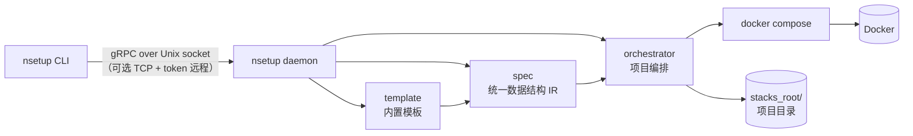
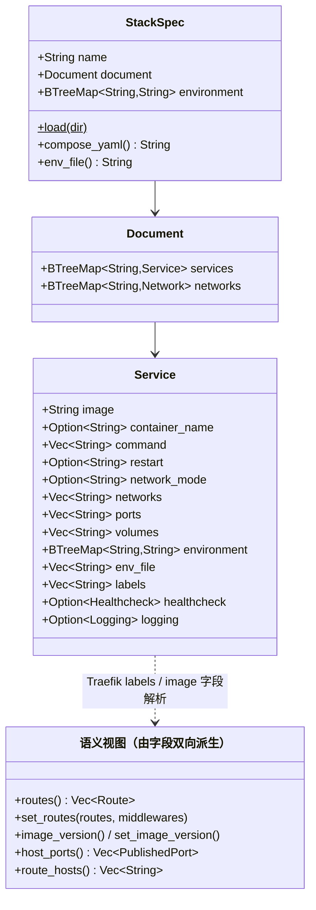
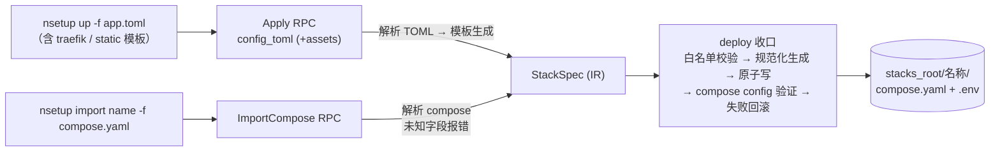
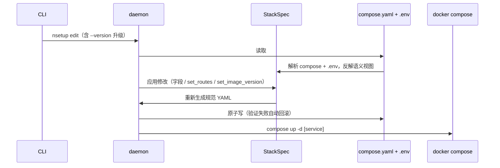

# nsetup 架构设计

`nsetup` 是 Linux 主机上的 Docker Compose 应用管理工具，面向家庭服务器场景：
一台机器、一个反向代理入口、若干容器化应用。

单个 musl 静态链接二进制包含两种角色：

- **daemon**：以 root 运行的 systemd 服务，独占 Docker 操作权限；
- **CLI**：普通用户使用的管理命令，通过本机 Unix socket 上的 gRPC 调用 daemon。
  `nihility` 用户组成员即可操作，无需 `sudo`。



## 统一数据结构（IR）

整个系统只有一种「应用运行所需数据」的表示（IR）。任何输入（TOML 配置、CLI
标志、compose 文件）都先转换为 IR，daemon 只从 IR 生成 `compose.yaml`；修改时
从 `compose.yaml` + `.env` 解析回 IR，改完重新生成。compose 文件是项目状态的
唯一持久化真相。



- `Document`/`Service` 是 compose YAML 的强类型模型，serde 双向（序列化 +
  解析），全部 `deny_unknown_fields`：不在上表中的 compose 指令（如
  `depends_on`、`build`、顶层 `volumes`、list 形式的 environment/labels）在
  导入时直接报错，错误信息指出具体字段。
- 语义视图不独立存储：路由、中间件、镜像版本由 labels 和 image 字段按需解析；
  修改时清除旧的生成 labels 再重新生成，派生数据与字段永远一致。
- `.env` 解析为 `environment` 映射。模板附属文件（Traefik 中间件定义、站点
  内容）不属于 IR，只在应用配置时写盘，编辑不触碰。

## 应用配置格式（TOML）

TOML 是唯一的声明式配置格式，用 `template` 字段选择内置模板，缺省 `app`。
`nsetup template <名称>` 输出带注释的配置骨架。

### app 模板（缺省）：容器应用，支持单服务或多服务

```toml
format = 1
name = "media"

[services.web]
image = "ghcr.io/example/media"    # 镜像仓库，不含标签
version = "1.0"                    # 镜像版本标签（独立配置，升级即改此项）
port = 8080                        # 容器端口，供路由与发布使用
publish = ["12780:8080/tcp"]       # 宿主机端口映射
volumes = ["/srv/media:/data"]     # 绝对路径 bind mount
environment = { LOG_LEVEL = "info" }
command = ["--serve"]
network = "bridge"                 # bridge | host | external
external_network = "my-net"        # network = "external" 时使用
labels = ["com.example.team=infra"]
[services.web.healthcheck]
command = "curl -fsS http://localhost:8080/health"
interval = "30s"
timeout = "3s"
retries = 3

[services.web.traefik]             # 反向代理路由（可多个 host）
hosts = ["media", "media.example.com"]
middlewares = ["gzip", "internal-only"]
protocol = "http"                  # http | https | h2c
sticky_cookie = false
priority = 100

[services.worker]
image = "ghcr.io/example/worker"
version = "1.2"
```

`image` 与 `version` 在生成时合成 `image:version` 写入 IR，解析时拆开；`image`
本身带标签或摘要属于配置错误。三个模板的版本字段语义一致（traefik 的
`version` 是 Traefik 镜像版本，static 的是 Nginx 镜像版本），版本校验（C1）
统一作用于该字段。

### traefik 模板：反向代理基础设施

```toml
format = 1
template = "traefik"
domain = "example.com"
acme_email = "admin@example.com"
cloudflare_token = "..."
version = "v3.8.0"
http_port = 80
https_port = 443
```

生成 Traefik 项目：ACME + Cloudflare DNS 证书、HTTP→HTTPS 重定向、HTTP/3、
仅内网可访问的 dashboard，以及供所有应用引用的中间件配置（gzip /
forwarded-headers / internal-only / tls）。Traefik 项目与应用项目完全同构：
同样经 IR 生成、受同样的约束、用同样的命令运维。升级 Traefik 就是修改
`version` 后重新 `up --force`。

### static 模板：Nginx 静态站点

```toml
format = 1
template = "static"
name = "docs"
host = "docs"
version = "1.27"
middlewares = ["gzip"]
```

站点文件不写入 TOML，由 `up --assets <目录>` 随请求上传，落盘到项目目录后
以白名单内绝对路径挂载。

## 数据流

### 创建与更新

CLI 标志类命令（如 `edit` 之外的创建入口）在客户端构建 TOML；daemon 侧只有
两条输入路径：TOML（`Apply`）与 compose 文件（`ImportCompose`），二者都汇入
IR 后由唯一的写盘收口生成项目。



### 修改



### 导出

`nsetup export`：解析项目的 compose + .env，反解出完整 TOML（app 模板还原
各服务字段与路由选项；traefik / static 模板还原模板参数）。导出内容永远等于
当前真实状态，可直接用于 `up` 重建项目。

## 命令设计

远程访问是全局标志而非独立命令树：任何命令都可加 `--endpoint <地址>
--token-file <路径>` 连接远程 daemon，本机缺省走 Unix socket。

| 命令 | 说明 |
| --- | --- |
| `nsetup init [--domain D] [--stacks-root P] [--data-root P]... [--docker-socket P] [--force]` | 安装 daemon：写配置、安装二进制与 systemd unit、启动服务。`--force` 覆盖已存在的安装，未指定的配置项沿用已有值 |
| `nsetup status` | daemon 版本、Docker 连通性、项目根目录、主域名 |
| `nsetup template [app\|traefik\|static]` | 输出带注释的配置骨架 |
| `nsetup up -f <配置.toml> [--assets <目录>] [--start] [--force]` | 创建或整体更新项目；模板通用入口 |
| `nsetup import <名称> -f <compose.yaml> [--env-file <路径>] [--start]` | 导入 compose 文件（字段子集），新建或整体替换 |
| `nsetup export <名称> [-o <输出.toml>]` | 导出当前状态的 TOML |
| `nsetup edit <名称> [--service <服务>] [选项...]` | 局部修改：`--version`（升级镜像）、`--image`、`--port`、`--publish`、`--volume`、`--env`、`--host`、`--middleware`、`--label`、`--healthcheck-cmd`、`--remove-healthcheck`、`--start` 等；未指定的项保持不变 |
| `nsetup list` / `nsetup show <名称>` | 项目列表 / 项目与容器详情 |
| `nsetup start / stop / restart <名称>` | 生命周期 |
| `nsetup pull <名称>` | 拉取镜像，流式显示进度 |
| `nsetup build <名称>` | 构建镜像 |
| `nsetup logs <名称> [--tail N] [-f]` | 日志，可跟随 |
| `nsetup rm <名称> [--force]` | 停止并删除项目（`--force` 跳过确认）；绑定挂载的数据不受影响 |

`nsetup daemon` 为隐藏命令，仅供 systemd unit 的 `ExecStart` 调用。daemon 的
启停与开机自启用 `systemctl` 管理。

## RPC 接口

proto 定义与命令一一对应，共 14 个方法。声明式输入一律是 TOML 字符串；只有
`Edit` 使用类型化字段表达局部修改：

```protobuf
service Orchestrator {
  rpc Status(StatusRequest) returns (StatusResponse);

  rpc Apply(ApplyRequest) returns (OperationResponse);
  rpc ImportCompose(ImportComposeRequest) returns (OperationResponse);
  rpc Export(ExportRequest) returns (ExportResponse);
  rpc Edit(EditRequest) returns (OperationResponse);

  rpc List(ListRequest) returns (ListResponse);
  rpc Get(GetRequest) returns (Stack);
  rpc Remove(RemoveRequest) returns (OperationResponse);
  rpc Start(ActionRequest) returns (OperationResponse);
  rpc Stop(ActionRequest) returns (OperationResponse);
  rpc Restart(ActionRequest) returns (OperationResponse);
  rpc Pull(ActionRequest) returns (stream PullProgress);
  rpc Build(ActionRequest) returns (OperationResponse);
  rpc Logs(LogsRequest) returns (stream LogLine);
}

message ApplyRequest {
  string config_toml = 1;
  repeated Asset assets = 2;    // static 模板的站点文件
  bool start = 3;
  bool force = 4;               // 覆盖已存在的项目
}

message ImportComposeRequest {
  string name = 1;
  string compose_yaml = 2;
  optional string env_file = 3; // 缺省：新项目为空，已有项目沿用原文件
  bool start = 4;
}

message EditRequest {
  string name = 1;
  optional string service = 2;  // 单服务项目可省略
  optional string image = 3;
  optional string version = 4;
  repeated string command = 5;
  optional uint32 container_port = 6;
  repeated Route routes = 7;        // 提供时整体重建路由
  repeated PublishedPort published_ports = 8;
  repeated Volume volumes = 9;      // 追加
  map<string, string> environment = 10; // 合并
  optional NetworkMode network_mode = 11;
  optional string external_network = 12;
  repeated Middleware middlewares = 13;
  repeated string labels = 14;      // 按键替换
  optional Healthcheck healthcheck = 15;
  bool remove_healthcheck = 16;
  bool start = 17;
}
```

## 配置文件

`/etc/nsetup/config.toml`，扁平键：

```toml
domain = "example.com"                       # 短子域名拼接的主域名
stacks_root = "/var/lib/nsetup/stacks"       # 项目根目录
data_roots = ["/var/lib/nsetup/data"]        # bind mount 允许的路径前缀
listen = "unix:///run/nsetup/nsetup.sock"    # gRPC 监听；TCP 地址需配合 auth token
docker_socket = "/var/run/docker.sock"       # Docker API socket
```

bind mount 白名单 = `data_roots` ∪ `stacks_root` ∪ `docker_socket`（精确匹配），
完全由配置推导。

## 磁盘布局

| 内容 | 路径 |
| --- | --- |
| 二进制 | `/usr/local/bin/nsetup` |
| systemd unit | `/etc/systemd/system/nsetup.service` |
| 配置文件 | `/etc/nsetup/config.toml`（`root:nihility`、`0640`） |
| TCP 认证 token | `/etc/nsetup/auth.token`（`0600`） |
| gRPC socket | `/run/nsetup/nsetup.sock`（`root:nihility`、`0660`） |
| 项目 | `stacks_root/<名称>/{compose.yaml, .env, config/, site/}` |

## 模块划分

| 模块 | 职责 |
| --- | --- |
| `cli` | CLI 稳定入口，重新导出参数模型和命令执行器 |
| `cli/args` | clap 参数、子命令以及中文帮助模板 |
| `cli/runner` | 本地命令和远程 RPC 命令分发 |
| `cli/edit` | 编辑参数到类型化 protobuf 请求的转换 |
| `cli/io` | 配置、静态资源、导出文件与 stdout 操作 |
| `config` | 配置文件模型、加载、白名单推导 |
| `install` | init：自安装与 systemd unit 管理 |
| `spec` | IR 公共数据模型与稳定入口；具体职责拆入 `spec/project`、`spec/service`、`spec/value` |
| `spec/project` | 项目级 compose YAML、`.env` 加载、校验与规范化序列化 |
| `spec/service` | 服务镜像版本与 Traefik label 语义视图的双向转换 |
| `spec/value` | 路由、端口、bind mount、健康检查、镜像与名称值对象校验 |
| `template` | 模板公共 TOML 模型、注册表与稳定入口 |
| `template/generate` | app/traefik/static TOML → IR，并生成模板附属文件 |
| `template/reverse` | 当前 IR → 规范化 TOML，恢复模板参数与服务语义 |
| `template/skeleton` | CLI 输出的带注释 TOML 配置骨架 |
| `orchestrator` | 编排器及其请求、响应公共模型 |
| `orchestrator/operations` | 应用、导入、查询和项目生命周期操作 |
| `orchestrator/edit` | 服务局部编辑、标签合并和网络语义修改 |
| `orchestrator/deploy` | deploy 写盘收口、冲突检查和受管目录解析 |
| `orchestrator/storage` | 安全路径、附属文件复制、原子文件写入和回滚辅助 |
| `docker` | `docker compose` 子进程封装（统一使用配置的 `docker_socket`） |
| `rpc` | 生成协议模块及 RPC 稳定入口 |
| `rpc/service` | gRPC 服务方法、全局互斥和阻塞编排调度 |
| `rpc/client` | Unix socket 与认证 TCP 客户端 |
| `rpc/transport` | UDS/TCP 监听、Bearer 认证和关闭信号 |
| `rpc/conversion` | protobuf 线路表示与领域模型之间的转换和校验 |

## 设计约束

- **C1 镜像钉版本**：所有镜像必须带明确标签，拒绝 `latest` 与缺省标签；标签
  须以字母、数字或下划线开头，仅含字母、数字、点、下划线、连字符，不超过
  128 字符。
- **C2 校验先行**：项目名（小写字母开头，仅小写字母/数字/`-`/`_`，≤63 字符）、
  服务名、镜像引用、域名、宿主端口与路由冲突都在写入前校验，失败无副作用。
- **C3 写盘单点收口**：所有 compose 写入经过同一个 deploy 收口：白名单校验 →
  规范化生成 → 原子写 → `docker compose config` 验证 → 失败恢复原文件。
- **C4 密钥与权限**：token、ACME 密钥等从文件读取并写入 `.env`（`0600`），
  不进入 shell 历史与命令行参数；socket 与配置文件权限见磁盘布局表。
- **C5 compose 字段子集**：只接受 IR 模型覆盖的 compose 指令，未知字段导入时
  报错。这保证任何项目都能被解析回 IR 进行编辑与导出。
- **C6 数据路径白名单**：bind mount 源路径必须是绝对路径（相对路径报错），
  归一化（解析 `.`/`..`、符号链接）后落在 `data_roots` 或 `stacks_root` 前缀
  内，或等于 `docker_socket` 路径。白名单完全由配置推导，对所有项目（含
  Traefik）一视同仁。多个应用挂载同一路径以共享数据是合法用法。Docker 启动
  容器时会自动创建缺失的宿主目录，因此校验发生在任何 `compose up` 之前。
- **C7 禁止命名卷**：持久化数据一律使用白名单内的 bind mount，位置可审计、
  可备份。compose 顶层 `volumes` 段与 `NAME:/path` 语法在导入时报错。
  删除项目只停止容器并删除项目目录，绑定挂载的数据不受影响。
- **C8 变量镜像只读**：镜像引用含环境变量（如 Traefik 的
  `${TRAEFIK_VERSION}`）的项目不能用 `edit --version` 升级；其版本由所属
  模板的参数管理，通过 `up --force` 整体应用。
